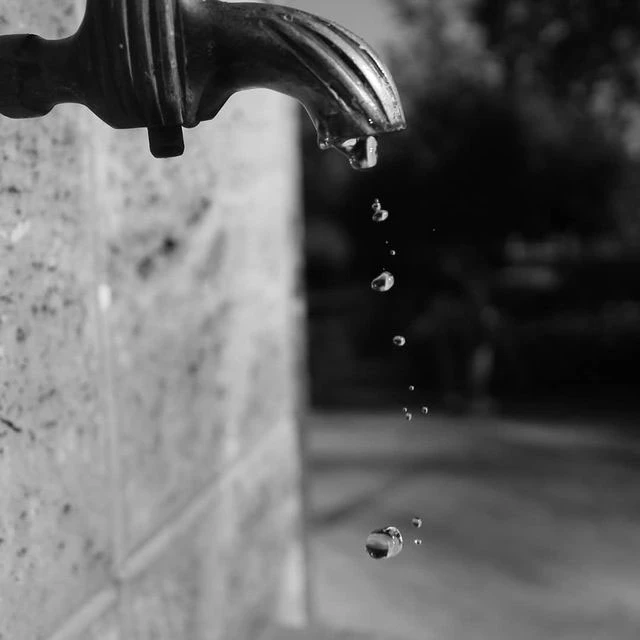
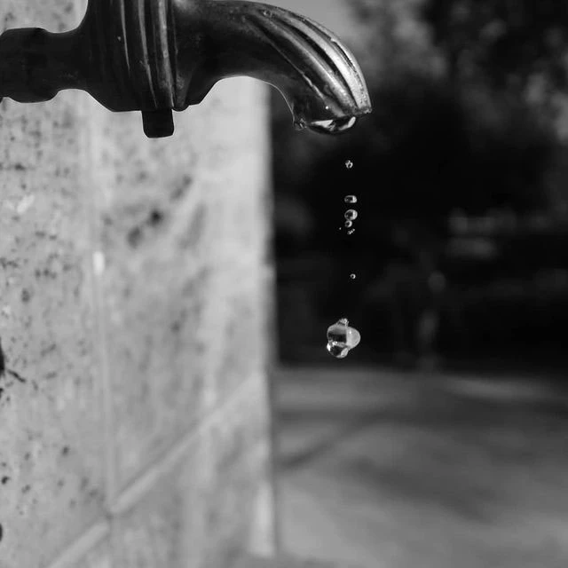
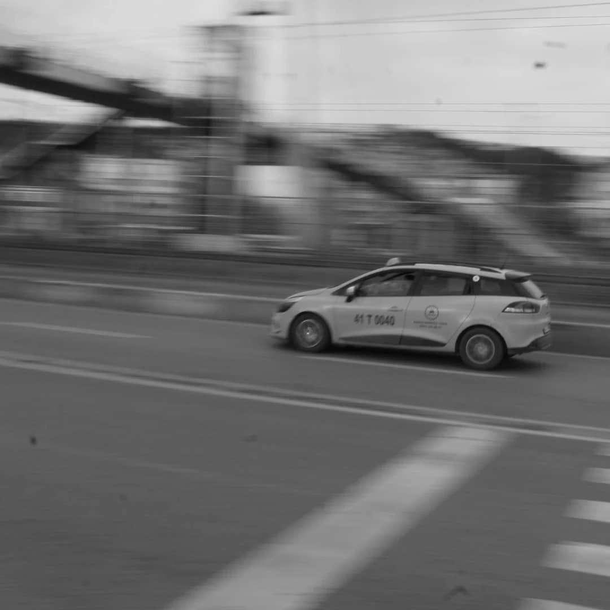

# seckinportf-y
Fotoğrafçılık, web tasarım, video tasarım, sosyal medya çalışmalarımın yer aldığı çalışmalar
<!DOCTYPE html>
<html lang="tr">
<head>
    <meta charset="UTF-8">
    <meta name="viewport" content="width=device-width, initial-scale=1.0">
    <title>Seçkin Özdemir - Portfolyo</title>
    
</head>
<body>

    <header>
        <h1>Seçkin Özdemir</h1>
        
Portfolyo & Çalışmalar

    </header>

    <main>
        

            

                <button class="tab-button active" onclick="openTab(event, 'cekim-calismalari')">Çekim Çalışmaları</button>
                <button class="tab-button" onclick="openTab(event, 'site-tasarimlari')">Site Tasarımları</button>
            

            <!-- ÇEKİM ÇALIŞMALARI SEKMESİ -->
            

                

                    

                        
                        

                            <h3>Damlayan Çeşme - Seri 1</h3>
                            
Yüksek enstantane ile su damlasının anlık dondurulması (Siyah-Beyaz).

                        

                    

                    

                        
                        

                            <h3>Damlayan Çeşme - Seri 2</h3>
                            
Makro perspektif ve yer çekimi hareketinin detaylandırılması.

                        

                    

                    

                        
                        

                            <h3>Damlayan Çeşme - Seri 3</h3>
                            
Işık ve gölge dengesiyle odaklanmış su damlası kadrajı.

                        

                    

                    

                        
                        

                            <h3>Panning Tekniği - Şehir Akışı</h3>
                            
Uzun pozlama ve araç takibi ile dinamik hareket hissi çekimi.

                        

                    

                    

                        
                        

                            <h3>Göl Kenarı ve Özgürlük</h3>
                            
Doğa, su yansıması ve uçan martının minimalist siyah-beyaz kompozisyonu.

                        

                    

                    

                        
                        

                            <h3>Retro Oyuncak Makro Çekim</h3>
                            
Sığ derinlik alanı (DoF) ile doğa içinde ürün/obje odaklı konsept çalışması.

                        

                    

                    

                        
                        

                            <h3>Sonbahar ve Yansıma Panoraması</h3>
                            
Renk paleti dönüşümü ve su yüzeyi simetrisini vurgulayan üçlü kompozisyon.

                        

                    

                

            

            <!-- SİTE TASARIMLARI SEKMESİ -->
            

                

                    
                    

                        

                            <h3>81 Şehir 81 Müze</h3>
                            
Türkiye'nin 81 ilindeki tarihi ve kültürel müzeleri tek bir çatı altında toplayan dijital rehber projesi. Türkiye'nin zengin müze mirasını tanıtan ve ziyaretçilere detaylı bilgi sunan kapsamlı bir içerik platformudur.

                        

                        <a href="https://81sehir81muze.blogspot.com/" target="_blank" rel="noopener noreferrer">Siteyi İncele &rarr;</a>
                    

                    

                        

                            <h3>81 Şehir 81 Heykel</h3>
                            
Türkiye genelinde şehirlerin simgesi haline gelmiş anıt ve heykelleri derleyen sanatsal ve kültürel arşiv çalışması. İllerin kamusal sanat eserlerini ve tarihsel arka planlarını dijital ortama aktarır.

                        

                        <a href="https://81sehir81heykel.blogspot.com/" target="_blank" rel="noopener noreferrer">Siteyi İncele &rarr;</a>
                    

                    

                        

                            <h3>Türkiye Web Müzesi</h3>
                            
Türkiye'deki müzelerin dijital ortama aktarılması, çevrimiçi sergilenmesi ve sanal müze deneyiminin geniş kitlelere ulaştırılmasını hedefleyen dijital arşiv projesi.

                        

                        <a href="https://turkiyewebmuzesi.blogspot.com/" target="_blank" rel="noopener noreferrer">Siteyi İncele &rarr;</a>
                    

                    

                        

                            <h3>Benim Koçum</h3>
                            
Öğrenci koçluğu, eğitim danışmanlığı ve bireysel gelişim alanında hizmet sunan kurumsal web tasarımı. Kullanıcı dostu arayüzü ve sade tasarımıyla danışan odaklı bir platformdur.

                        

                        <a href="https://www.benimkocum.com.tr/" target="_blank" rel="noopener noreferrer">Siteyi İncele &rarr;</a>
                    

                

            

        

    </main>

    <!-- LIGHTBOX MODAL -->
    

        &times;
        
    

    
</body>
</html>
